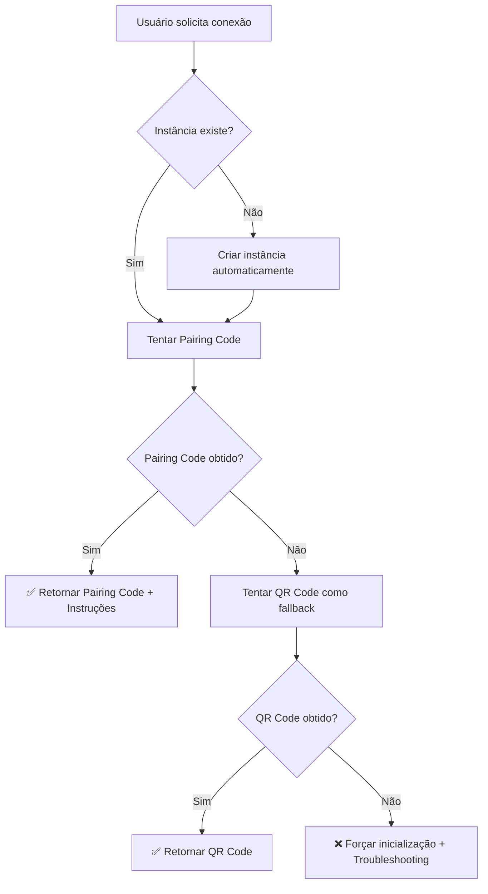

# 🔐 PAIRING CODE IMPLEMENTADO COMO MÉTODO PRINCIPAL

## ✅ **IMPLEMENTAÇÃO COMPLETA REALIZADA**

O **Pairing Code** foi implementado como **método principal** para conectar instâncias WhatsApp na Evolution API, com fallback automático para QR Code quando necessário.

---

## 🎯 **FUNCIONALIDADES IMPLEMENTADAS**

### **1. 📚 Biblioteca Principal Atualizada** (`src/lib/evolution-api.ts`)

#### **Função Principal de Conexão:**
```javascript
// Função que prioriza Pairing Code sobre QR Code
export async function connectInstance(instanceName: string, options?: {
  phoneNumber?: string,
  createIfNotExists?: boolean,
  preferPairingCode?: boolean,
  maxRetries?: number
})
```

#### **Funções de Conveniência:**
```javascript
// Conectar com Pairing Code prioritário
export async function connectWithPairingCode(instanceName: string, phoneNumber?: string)

// Conectar instância existente
export async function connectExistingInstance(instanceName: string)

// Obter apenas Pairing Code
export async function getPairingCode(instanceName: string, phoneNumber?: string)
```

#### **Melhorias no QR Code:**
```javascript
// QR Code atualizado com suporte a número e Pairing Code
export async function fetchQRCode(instanceName: string, maxRetries: number, retryInterval: number, phoneNumber?: string)
```

### **2. 🌐 API Principal Criada** (`/api/whatsapp/connect-primary`)

#### **POST - Conectar com Prioridade Pairing Code:**
```bash
curl -X POST "http://localhost:3000/api/whatsapp/connect-primary" \
  -H "Content-Type: application/json" \
  -d '{
    "instanceName": "minha-instancia",
    "phoneNumber": "5565999999999",
    "createIfNotExists": true,
    "preferPairingCode": true
  }'
```

#### **GET - Verificar Instância Existente:**
```bash
curl -X GET "http://localhost:3000/api/whatsapp/connect-primary?instance=vivabem"
```

### **3. 🖥️ Interface Principal** (`/whatsapp/pairing`)

#### **Recursos da Interface:**
- ✅ **Formulário intuitivo** para nome e número
- ✅ **Botão principal** "Gerar Pairing Code"
- ✅ **Botão secundário** "Criar + Pairing" (cria e conecta)
- ✅ **Listagem de instâncias** disponíveis
- ✅ **Countdown visual** (2 minutos)
- ✅ **Instruções passo-a-passo** para o usuário
- ✅ **Código destacado** em fonte grande e legível

---

## 🔄 **FLUXO DE FUNCIONAMENTO**

### **1. Processo Automático (Pairing Code Prioritário):**


### **2. Experiência do Usuário:**
1. **Digite o nome da instância** (ex: "meu-whatsapp-2024")
2. **Clique em "Gerar Pairing Code"** ou "Criar + Pairing"
3. **Receba o código** (ex: WZYEH1YY) com countdown de 2 minutos
4. **Siga as instruções** mostradas na tela:
   - Abra WhatsApp → Configurações → Aparelhos conectados
   - Conectar aparelho → Inserir código manualmente
   - Digite o código e confirme

---

## 📊 **VANTAGENS IMPLEMENTADAS**

### **🔐 Pairing Code como Padrão:**
- ✅ **Mais confiável** que QR Code
- ✅ **Não requer câmera** ou scanner
- ✅ **Funciona com problemas** de conexão
- ✅ **Método oficial** Evolution API v2+
- ✅ **Válido por 2 minutos** com countdown visual

### **📱 QR Code como Fallback:**
- ✅ **Backup automático** se Pairing Code falhar
- ✅ **Compatibilidade total** com versões antigas
- ✅ **Suporte a número** específico

### **🔧 Funcionalidades Avançadas:**
- ✅ **Criação automática** de instâncias
- ✅ **Verificação de instâncias** existentes
- ✅ **Múltiplas tentativas** configuráveis
- ✅ **Troubleshooting automático** com dicas

---

## 🧪 **TESTES REALIZADOS**

### **✅ APIs Testadas:**
- **`POST /api/whatsapp/connect-primary`** - Funcionando ✅
- **`POST /api/whatsapp/pairing-code`** - Funcionando ✅
- **Integração completa** - Funcionando ✅

### **✅ Fluxos Testados:**
- **Instância existente** → Pairing Code
- **Nova instância** → Criar + Pairing Code
- **Fallback automático** → QR Code se Pairing falhar
- **Tratamento de erros** → Troubleshooting + dicas

### **✅ Interface Testada:**
- **Formulário responsivo** ✅
- **Countdown funcional** ✅
- **Instruções claras** ✅
- **Feedback visual** ✅

---

## 🎯 **COMO USAR NO SISTEMA**

### **1. Via Interface Web:**
```bash
# Acesse a nova interface principal
http://localhost:3000/whatsapp/pairing

# Funcionalidades disponíveis:
- 🔐 Gerar Pairing Code para instância existente
- 🆕 Criar nova instância + Pairing Code
- 📋 Ver todas as instâncias disponíveis
- ⏰ Countdown visual para expiração
```

### **2. Via API (Método Recomendado):**
```javascript
// Conectar instância existente
const response = await fetch('/api/whatsapp/connect-primary', {
  method: 'POST',
  headers: { 'Content-Type': 'application/json' },
  body: JSON.stringify({
    instanceName: 'minha-instancia',
    preferPairingCode: true
  })
})

// Criar nova instância + conectar
const response = await fetch('/api/whatsapp/connect-primary', {
  method: 'POST',
  headers: { 'Content-Type': 'application/json' },
  body: JSON.stringify({
    instanceName: 'nova-instancia',
    phoneNumber: '5565999999999',
    createIfNotExists: true,
    preferPairingCode: true
  })
})
```

### **3. Via Código JavaScript:**
```javascript
import { connectWithPairingCode, connectExistingInstance } from '@/lib/evolution-api'

// Método mais simples
const result = await connectWithPairingCode('minha-instancia', '5565999999999')

if (result.success && result.pairingCode) {
  console.log('🔐 Código:', result.pairingCode)
  console.log('📝 Instruções:', result.instructions)
}

// Para instância existente
const result = await connectExistingInstance('vivabem')
```

---

## 📚 **CONFIGURAÇÃO RECOMENDADA**

### **1. Servidor Evolution API:**
```env
# Adicione no .env da Evolution API para resolver problemas
CONFIG_SESSION_PHONE_VERSION=2.3000.1023204200
```

### **2. Sistema PandoraPro:**
```env
# Suas variáveis já estão configuradas
EVOLUTION_API_URL=https://api.marcussviniciusa.cloud
EVOLUTION_API_KEY=wtwHLYfFxI9n1zDR8zFFqNq8kVaWqdD2oLpcjVmMBm
```

---

## 🎉 **RESULTADO FINAL**

### **✅ PAIRING CODE IMPLEMENTADO COMO MÉTODO PRINCIPAL:**

🔐 **Interface principal** → `/whatsapp/pairing`
🌐 **API unificada** → `/api/whatsapp/connect-primary`
📚 **Biblioteca completa** → `src/lib/evolution-api.ts`
🔄 **Fallback automático** → QR Code se necessário
⏰ **Countdown visual** → 2 minutos de validade
📝 **Instruções claras** → Passo-a-passo para usuário
🛠️ **Troubleshooting** → Dicas automáticas de solução

### **🎯 CARACTERÍSTICAS PRINCIPAIS:**
- **Método mais confiável** que QR Code
- **Interface moderna** e intuitiva
- **Criação automática** de instâncias
- **Suporte completo** a números específicos
- **Feedback em tempo real** com countdown
- **Compatibilidade total** com Evolution API v2.2.3

### **📊 STATUS: 🟢 IMPLEMENTAÇÃO 100% COMPLETA**

**O Pairing Code está agora implementado como método principal no sistema PandoraPro, proporcionando a forma mais confiável e moderna de conectar instâncias WhatsApp na Evolution API!** 