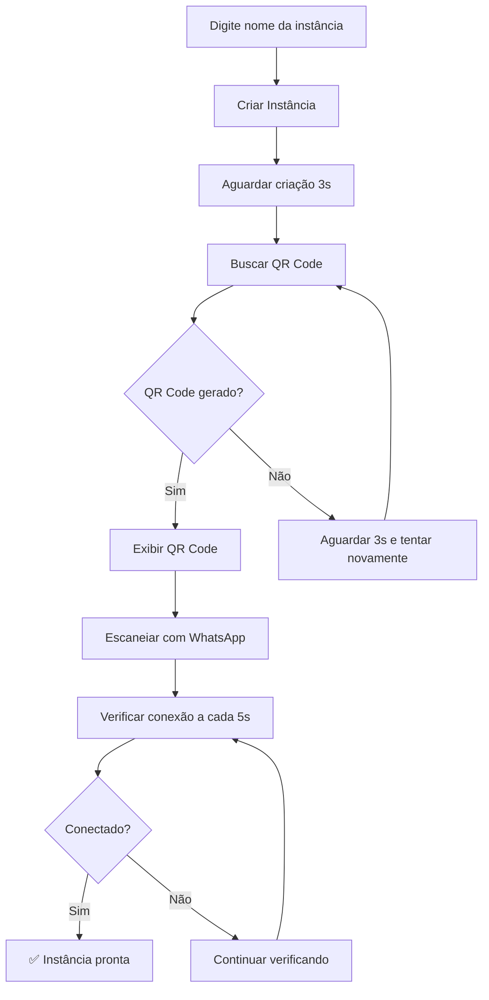

# 📱 Método QR Code Evolution API - Documentação Completa

## 🎯 Visão Geral

Este método permite **criar instâncias diretamente no sistema** e **conectar via QR Code**. É o método **principal e recomendado** para novos usuários.

## ✅ Vantagens

- 🚀 **Criação automática** de instâncias
- 📱 **QR Code integrado** no sistema  
- 🔄 **Verificação automática** de conexão
- 🎯 **Interface intuitiva** e moderna
- 📋 **Instruções passo-a-passo** integradas
- ⚡ **Conexão rápida** e confiável

## 🚀 Como Funciona

### 1. **Criar Instância**
   - Digite um nome único para a instância
   - Clique em "Criar Instância"
   - Aguarde a criação no servidor Evolution API

### 2. **Gerar QR Code**
   - Sistema busca automaticamente o QR Code
   - QR Code é exibido em tempo real
   - Renovação automática se expirar

### 3. **Conectar WhatsApp**
   - Abra WhatsApp no celular
   - Acesse "Aparelhos conectados"
   - Escaneie o QR Code exibido
   - Aguarde confirmação

### 4. **Verificação Automática**
   - Sistema verifica conexão automaticamente
   - Status em tempo real
   - Notificação quando conectado

## 🛠️ Estrutura Técnica

### APIs Implementadas

#### `/api/whatsapp/qrcode` (POST)
- **create**: Criar nova instância
- **qrcode**: Buscar QR Code
- **check**: Verificar conexão
- **delete**: Deletar instância
- **info**: Informações das instâncias

### Biblioteca (`src/lib/evolution-api.ts`)

#### Funções Principais:
```typescript
// Criação de instância
createInstance(instanceName, qrcode, integration)

// Buscar QR Code
fetchQRCode(instanceName, maxRetries, retryInterval)

// Verificar conexão
checkInstanceConnection(instanceName)

// Informações da instância
getInstanceInfo(instanceName)

// Deletar instância
deleteInstance(instanceName)

// Envio de mensagens
sendTextMessage(instanceName, number, text)
```

### Interface (`/whatsapp/qrcode-connect`)

#### Funcionalidades:
- ✅ Formulário de criação de instância
- ✅ Exibição de QR Code em tempo real
- ✅ Status da conexão com badges visuais
- ✅ Verificação automática a cada 5 segundos
- ✅ Instruções detalhadas integradas
- ✅ Troubleshooting e boas práticas

## 📊 Fluxo Completo



## 🔧 Configuração

### Variáveis de Ambiente (.env.local)
```env
EVOLUTION_API_URL=https://api.marcussviniciusa.cloud
EVOLUTION_API_KEY=wtwHLYfFxI9n1zDR8zFFqNq8kVaWqdD2oLpcjVmMBm
```

### Timeouts e Retries
- **QR Code**: 15 tentativas com 3 segundos de intervalo
- **Verificação de conexão**: A cada 5 segundos por 2 minutos
- **Expiração QR Code**: 60 segundos

## 📋 Instruções de Uso

### Para o Usuário Final:

1. **Acesse** `/whatsapp/qrcode-connect`
2. **Digite** um nome único para sua instância
3. **Clique** em "Criar Instância"
4. **Aguarde** o QR Code aparecer (5-10 segundos)
5. **Abra** o WhatsApp no celular
6. **Acesse** "Configurações > Aparelhos conectados"
7. **Toque** em "Conectar um aparelho"
8. **Escaneie** o QR Code exibido
9. **Aguarde** a confirmação de conexão

### Para Desenvolvedores:

#### Criar Instância via API:
```bash
curl -X POST http://localhost:3000/api/whatsapp/qrcode \
  -H "Content-Type: application/json" \
  -d '{"instanceName": "teste123", "action": "create"}'
```

#### Buscar QR Code:
```bash
curl -X POST http://localhost:3000/api/whatsapp/qrcode \
  -H "Content-Type: application/json" \
  -d '{"instanceName": "teste123", "action": "qrcode"}'
```

#### Verificar Conexão:
```bash
curl -X POST http://localhost:3000/api/whatsapp/qrcode \
  -H "Content-Type: application/json" \
  -d '{"instanceName": "teste123", "action": "check"}'
```

#### Enviar Mensagem:
```bash
curl -X POST http://localhost:3000/api/whatsapp/send-message \
  -H "Content-Type: application/json" \
  -d '{
    "instanceName": "teste123",
    "number": "5511999999999", 
    "message": "Teste via QR Code!"
  }'
```

## ⚠️ Troubleshooting

### Problemas Comuns:

#### QR Code não aparece:
- **Causa**: Instância ainda sendo criada
- **Solução**: Aguarde 10-15 segundos e tente novamente

#### QR Code expirou:
- **Causa**: QR Code tem validade de 60 segundos
- **Solução**: Clique em "Buscar QR Code" novamente

#### WhatsApp não conecta:
- **Causa**: Problema de internet ou WhatsApp desatualizado
- **Solução**: Verifique conexão e atualize WhatsApp

#### Erro ao criar instância:
- **Causa**: Nome já existe ou servidor indisponível  
- **Solução**: Use nome diferente ou verifique servidor

### Logs de Debug:

#### No Browser (Console):
```javascript
// Habilitar logs detalhados
localStorage.setItem('whatsapp-debug', 'true')
```

#### No Servidor:
```bash
# Verificar logs do Next.js
npm run dev

# Logs aparecem no terminal
```

## 🧪 Testes

### Teste Básico:
```bash
# 1. Criar instância
curl -X POST http://localhost:3000/api/whatsapp/qrcode \
  -H "Content-Type: application/json" \
  -d '{"instanceName": "teste_qr", "action": "create"}'

# 2. Buscar QR Code  
curl -X POST http://localhost:3000/api/whatsapp/qrcode \
  -H "Content-Type: application/json" \
  -d '{"instanceName": "teste_qr", "action": "qrcode"}'

# 3. Verificar conexão
curl -X POST http://localhost:3000/api/whatsapp/qrcode \
  -H "Content-Type: application/json" \
  -d '{"instanceName": "teste_qr", "action": "check"}'

# 4. Deletar instância
curl -X POST http://localhost:3000/api/whatsapp/qrcode \
  -H "Content-Type: application/json" \
  -d '{"instanceName": "teste_qr", "action": "delete"}'
```

## 📈 Status e Monitoramento

### Status da Instância:
- ⏳ **Aguardando**: Instância ainda não criada
- 🔄 **Conectando**: QR Code gerado, aguardando scan
- ✅ **Conectada**: WhatsApp conectado e pronto
- ❌ **Erro**: Problema na conexão

### Verificação de Saúde:
```bash
# Verificar se Evolution API está online
curl -H "apikey: $EVOLUTION_API_KEY" $EVOLUTION_API_URL

# Listar todas as instâncias
curl -X POST http://localhost:3000/api/whatsapp/qrcode \
  -H "Content-Type: application/json" \
  -d '{"instanceName": "any", "action": "info"}'
```

## 🚀 Próximos Passos

Após conectar via QR Code:

1. **Teste envio de mensagem** na página
2. **Configure webhooks** se necessário
3. **Implemente automações** usando as APIs
4. **Configure múltiplas instâncias** se precisar
5. **Monitore status** das conexões

## 📞 Suporte

- **Logs**: Verifique console do browser e terminal
- **APIs**: Teste endpoints individualmente  
- **Evolution API**: Verifique status do servidor
- **WhatsApp**: Mantenha app atualizado

---

**🎯 Método QR Code - Simples, rápido e eficiente!** 